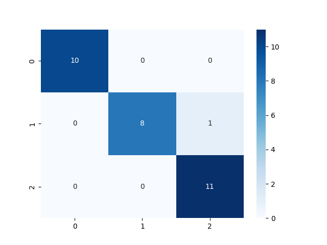

# Iris Classification using SVM

This is a beginner-level machine learning project that classifies the Iris dataset using a Support Vector Machine (SVM) with a linear kernel. The project is implemented in both Jupyter Notebook and a Python script, producing similar results with an accuracy of 96.67%.

## Project Overview

- **Model**: Support Vector Machine (SVM)
- **Dataset**: Iris dataset from `sklearn.datasets` || [from here](https://gist.githubusercontent.com/curran/a08a1080b88344b0c8a7/raw/0e7a9b0a5d22642a06d3d5b9bcbad9890c8ee534/iris.csv)  || and i have included in my repo as well
- **Accuracy**: 96.67%
- **Libraries Used**: `scikit-learn`, `matplotlib`, `seaborn`, `pandas`

## How to Run

### 1. Jupyter Notebook:
- Install dependencies:
  ```bash
  pip install -r requirements.txt
  ```
- Run Jupyter Notebook:
  ```bash
  jupyter notebook
  ```
- Open `iris_model.ipynb` and run the cells.

### 2. Python Script (VSCode or Terminal):

(Optional) **Use a virtual environment** for better dependency management:

- Create a virtual environment (optional but recommended):
  ```bash
  python -m venv venv
  ```
- Activate the virtual environment:
  - On Windows:
    ```bash
    .\venv\Scripts\activate
    ```
  - On macOS/Linux:
    ```bash
    source venv/bin/activate
    ```
- Install dependencies:
  ```bash
  pip install -r requirements.txt
  ```
- Run the script:
  ```bash
  python iris_classification.py
  ```

## Expected Output
Both methods will display:
- **Accuracy**: 96.67%
- **Confusion Matrix**: A heatmap showing model performance.

### Result

After running the script or notebook, you will see the confusion matrix heatmap, which shows how well the model performed on the test data. Additionally, the result is saved as an image named `result.png` in the root folder.

#### Understanding the Confusion Matrix in `result.png`:

A confusion matrix is a table that helps evaluate the performance of a classification model. It shows how many samples were correctly and incorrectly classified by the model for each class.

For this project, the confusion matrix for the Iris dataset will be a 3x3 table because there are 3 classes (Setosa, Versicolor, and Virginica).

| Actual \ Predicted | Setosa | Versicolor | Virginica |
|--------------------|--------|------------|-----------|
| **Setosa**         | 10     | 0          | 0         |
| **Versicolor**     | 0      | 8          | 0         |
| **Virginica**      | 0      | 0          | 11        |

- **Diagonal values (10, 8, 11)**: These represent the correctly classified samples for each class:
  - 10 Setosa samples were correctly classified as Setosa.
  - 8 Versicolor samples were correctly classified as Versicolor.
  - 11 Virginica samples were correctly classified as Virginica.
  
- **Off-diagonal values**: These represent misclassifications:
  - There were no misclassifications in this case, as all off-diagonal values are zero.

#### Heatmap:
The confusion matrix is visualized as a heatmap using `seaborn`, where darker colors represent higher counts. The heatmap helps you quickly see how the model performed on each class.


